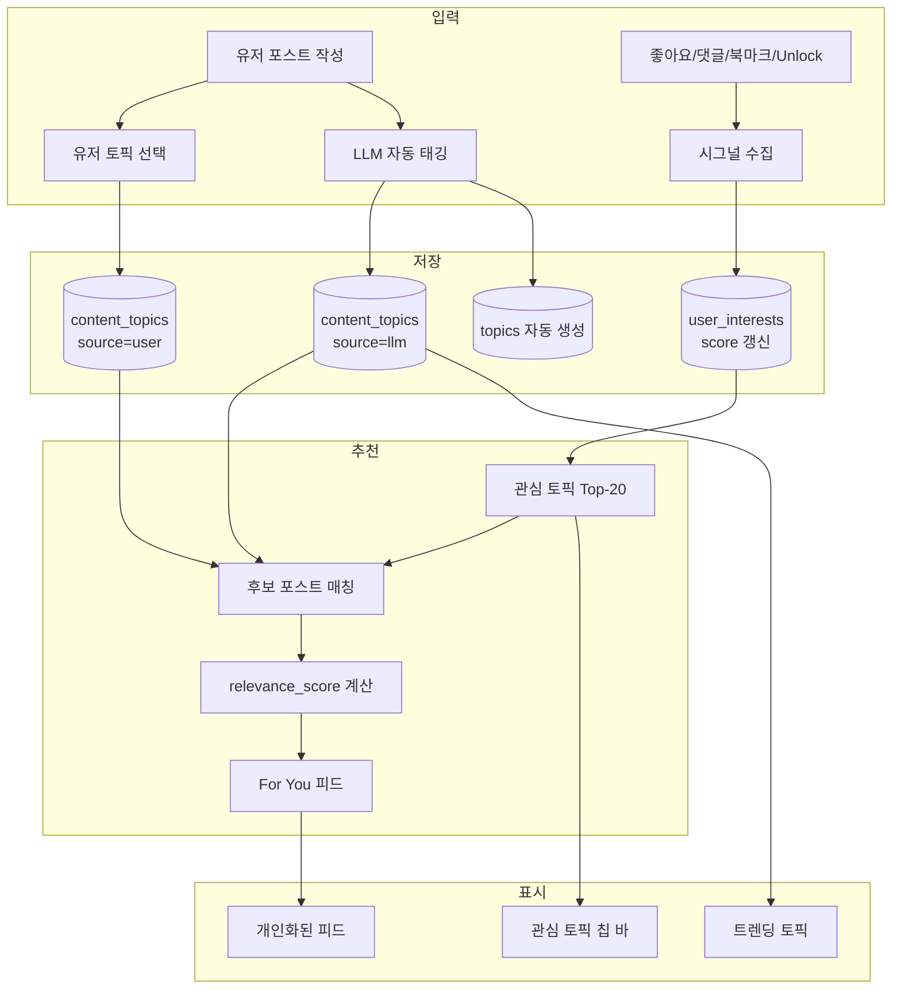

# momment. 추천 시스템 계획서

> 작성일: 2026-05-21  
> 최종 업데이트: 2026-05-22  
> 상태: **Phase 1~4 구현 완료** ✅

## 목표

토픽 태깅 시스템을 기반으로, **유저별 관심사를 학습**하고 **개인화된 포스트/어텐션 추천**을 제공한다.

---

## Phase 1: Interest Profile 구축

### 1.1 유저 관심사 시그널 수집

유저의 행동에서 관심 토픽을 추출한다:

| 시그널 | 가중치 | 수집 방식 |
|--------|--------|----------|
| **포스트 작성 토픽** (user-selected) | ×5.0 | 직접 선택한 토픽 = 명시적 관심 |
| **포스트 작성 토픽** (llm-tagged) | ×3.0 | 쓴 글의 LLM 태그 = 암묵적 관심 |
| **좋아요** 누른 포스트의 토픽 | ×2.0 | post_reactions → content_topics JOIN |
| **북마크** 한 포스트의 토픽 | ×3.0 | bookmarks → content_topics JOIN |
| **댓글** 단 포스트의 토픽 | ×2.5 | comments → parent post → content_topics |
| **프리미엄 unlock** 한 포스트의 토픽 | ×4.0 | post_unlocks → content_topics (돈 쓴 관심) |
| **어텐션 참여** 클러스터의 토픽 | ×3.5 | attention_memberships → content_topics |
| **포스트 클릭 후 체류시간** | ×1.0–3.0 | 클라이언트 이벤트 (향후) |

### 1.2 `user_interests` 테이블 (신규)

```sql
CREATE TABLE public.user_interests (
  id UUID PRIMARY KEY DEFAULT gen_random_uuid(),
  user_id UUID NOT NULL REFERENCES profiles(id) ON DELETE CASCADE,
  topic_id UUID NOT NULL REFERENCES topics(id) ON DELETE CASCADE,
  score NUMERIC NOT NULL DEFAULT 0,        -- 가중 합산 점수
  interaction_count INT NOT NULL DEFAULT 0, -- 총 인터랙션 수
  last_interaction_at TIMESTAMPTZ,
  created_at TIMESTAMPTZ NOT NULL DEFAULT now(),
  updated_at TIMESTAMPTZ NOT NULL DEFAULT now(),
  UNIQUE(user_id, topic_id)
);
```

### 1.3 점수 업데이트 로직

```
이벤트 발생 (좋아요, 댓글, 작성 등)
  → 해당 포스트의 content_topics 조회
  → 각 토픽에 대해:
     user_interests UPSERT
       score += 시그널 가중치 × topic.confidence
       interaction_count += 1
       last_interaction_at = now()
```

**시간 감쇠 (Time Decay)**:
```
effective_score = score × decay_factor^(days_since_last_interaction)
decay_factor = 0.95  (하루에 5%씩 감소)
```
→ 최근 관심사가 더 높은 가중치를 가짐.

---

## Phase 2: 추천 알고리즘

### 2.1 "For You" 피드 개인화

현재 "For You" 피드는 `created_at DESC` 단순 정렬이다.  
이를 **관심사 기반 스코어링**으로 대체한다.

```
post_relevance_score = Σ (user_interest_score[topic] × topic_confidence)
                       + recency_bonus
                       + engagement_bonus
                       + diversity_penalty
```

| 요소 | 공식 | 설명 |
|------|------|------|
| **관심사 매칭** | `Σ interest.score × confidence` | 유저 관심 토픽 매칭도 |
| **신선도** | `1 / (1 + hours_since_post / 24)` | 24시간 반감기 |
| **인기도** | `log(1 + likes + comments × 2)` | 커뮤니티 반응 |
| **다양성** | `-0.3 × same_topic_in_last_5` | 같은 토픽 연속 방지 |

### 2.2 추천 API 설계

```
GET /api/feed/recommended?limit=20&cursor=xxx

1. user_interests에서 상위 20개 관심 토픽 조회
2. content_topics에서 해당 토픽의 최근 포스트 후보 200개 조회
3. 각 포스트에 relevance_score 계산
4. 이미 본 포스트 제외 (viewed_posts 테이블 또는 클라이언트 캐시)
5. 상위 20개 반환
```

### 2.3 DB 함수 (Supabase RPC)

```sql
CREATE FUNCTION get_recommended_posts(p_user_id UUID, p_limit INT DEFAULT 20)
RETURNS TABLE (post_id UUID, relevance_score NUMERIC)
AS $$
  WITH user_topics AS (
    SELECT topic_id, score
    FROM user_interests
    WHERE user_id = p_user_id
    ORDER BY score DESC
    LIMIT 20
  ),
  candidate_posts AS (
    SELECT DISTINCT ct.target_id AS post_id,
           SUM(ut.score * COALESCE(ct.confidence, 0.8)) AS topic_score
    FROM content_topics ct
    JOIN user_topics ut ON ct.topic_id = ut.topic_id
    WHERE ct.target_type = 'post'
      AND ct.created_at > now() - INTERVAL '7 days'
    GROUP BY ct.target_id
  )
  SELECT cp.post_id,
         cp.topic_score
         + (1.0 / (1 + EXTRACT(EPOCH FROM now() - p.created_at) / 86400))
         + LN(1 + p.like_count + p.comment_count * 2)
         AS relevance_score
  FROM candidate_posts cp
  JOIN posts p ON p.id = cp.post_id
  WHERE p.is_deleted = false AND p.visibility = 'public'
  ORDER BY relevance_score DESC
  LIMIT p_limit;
$$ LANGUAGE SQL STABLE;
```

---

## Phase 3: 추천 UI

### 3.1 홈 피드 통합

```
┌─────────────────────────────────┐
│  [For You]  [Following]         │  ← 기존 탭
│─────────────────────────────────│
│  추천 포스트 (관심사 기반 정렬)    │  ← Phase 2 적용
│  ...                            │
│─────────────────────────────────│
│  📌 당신이 관심 있을 토픽          │  ← Phase 3.2
│  [#Bitcoin] [#UFC] [#AI] [+더보기]│
│─────────────────────────────────│
│  🔥 지금 뜨는 토픽               │  ← Phase 3.3
│  #Trump  +340%                  │
│  #Ethereum  +120%               │
└─────────────────────────────────┘
```

### 3.2 관심 토픽 칩 바

피드 상단에 유저의 Top-N 관심 토픽을 칩으로 표시:
- 클릭 → 해당 토픽 포스트만 필터
- "+" 버튼 → 토픽 탐색/구독 페이지

### 3.3 트렌딩 토픽 사이드바

```
topic_trend_snapshots 테이블 활용:
  - 24시간 윈도우의 post_count 변화율 계산
  - 상위 10개 트렌딩 토픽 표시
  - 각 토픽의 post_count 증가율(%) 표시
```

### 3.4 "이 글과 비슷한 포스트" (포스트 상세)

```
현재 포스트의 토픽 → content_topics에서 동일 토픽 가진 포스트 조회
→ 현재 포스트 제외 → 관련성 스코어 정렬 → 하단에 3~5개 표시
```

---

## Phase 4: 어텐션 추천

### 4.1 관심 어텐션 추천

```
유저 관심 토픽 → content_topics(target_type='attention') 매칭
→ 아직 참여하지 않은 어텐션 클러스터 추천
→ 탐색(Explore) 페이지 또는 사이드바에 표시
```

### 4.2 어텐션 내 추천 포스트

```
어텐션 클러스터 상세 페이지:
  - 해당 어텐션의 토픽과 유저 관심 토픽 교집합 계산
  - 관련성 높은 포스트를 상단에 배치
```

---

## 구현 로드맵

| Phase | 내용 | 예상 기간 | 상태 |
|-------|------|----------|------|
| **Phase 1** | user_interests 테이블 + 시그널 수집 트리거 | 완료 | ✅ 배포됨 |
| **Phase 2** | 추천 알고리즘 RPC + API + 피드 통합 | 완료 | ✅ 배포됨 |
| **Phase 3** | 추천 UI (토픽 칩 바, 비슷한 포스트) | 완료 | ✅ 배포됨 |
| **Phase 4** | 어텐션 추천 (사이드바) | 완료 | ✅ 배포됨 |
| **Phase 5** | A/B 테스트 + 튜닝 | 지속적 | 대기 |

---

## 데이터 흐름 전체도



---

## 핵심 설계 원칙

1. **Cold Start 해결**: 신규 유저는 인기 포스트 + 시드 토픽 기반 추천 → 행동 쌓이면 개인화 전환
2. **필터 버블 방지**: 다양성 페널티 + 10~20% 랜덤 발견 포스트 혼합
3. **투명성**: 유저가 자신의 관심 토픽 프로필을 확인/편집 가능 (프로필 설정)
4. **점진적 배포**: Phase 1~2는 백엔드만, Phase 3에서 UI 노출 → 데이터 축적 후 활성화
5. **비용 효율**: 추천 로직은 SQL 기반 (LLM 호출 없음), 태깅만 LLM 사용
