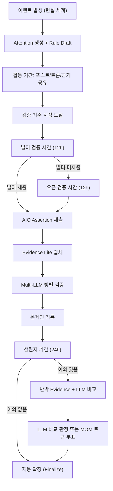

# momment. AIO 핵심 구조 전체 정리

> 이 문서는 `moment_aio.md`, `moment_AIO_Attention_Protocol_Plan.md`, `moment_Attention_Post_Graph_Plan.md`, `AGENT_DESIGN_SYNC.md`, `MOM_Event_Attention_SocialFi_Dev_Guidance.md`를 기반으로, 현재 내가 이해하고 있는 momment. 플랫폼의 모든 핵심 구조를 정리한 것입니다.

---

## 1. 플랫폼 본질: "Event Attention SocialFi"

momment.는 **예측시장(Polymarket)이 아닙니다**. 사용자가 실돈으로 YES/NO에 베팅하는 구조가 아니라, 글로벌 예측시장과 현실 이벤트를 **관찰·분석·토론하는 소셜 피드** 위에 **AIO(Agentic-Interoperable Oracle)**라는 사실 검증 인프라를 결합한 플랫폼입니다.

```
글로벌 이벤트 / 예측시장 데이터
         ↓
momment. 소셜 피드 (토론, 근거, 예측 의견)
         ↓
구독 / 부스트 / 슈퍼댓글 / 광고 등 → 플랫폼 수익
         ↓
momment vault → Contribution Ratio 기준 분배
```

> [!IMPORTANT]
> **절대 원칙**: momment. 안에서 사용자는 실돈으로 결과에 베팅하지 않습니다. 케이스 선택(YES/NO)은 **의견 분류**이지 베팅 포지션이 아닙니다.

---

## 2. 콘텐츠 계층: Topic > Attention > Post

### 핵심 3계층

| 계층 | 역할 | 비유 | 라우트 |
|------|------|------|--------|
| **Topic** | 장기 관심사 클러스터 (Reddit의 subreddit) | `#bts`, `#bitcoin-etf` | `/topic/[slug]` |
| **Attention** | 검증 시점이 있는 질문형 이벤트 단위 (Polymarket의 market) | "BTS가 2026년 6월에 컴백하는가?" | `/a/[slug]` |
| **Post** | 유저 발화 (X/Threads의 트윗) | 분석글, 의견, 근거 공유 | `/posts/[postId]` |

### 관계 구조

```
Topic (#bts)
  ├─ Attention (a/bts-2026-june-comeback)
  │    ├─ Posts (의견/근거 공유)
  │    │    ├─ Reposts / Quote Posts
  │    │    └─ Comments → Comment Replies
  │    ├─ Cases/Options (YES / NO)
  │    ├─ External Sources (Polymarket, Kalshi, 뉴스)
  │    ├─ AIO Rules (검증 기준)
  │    └─ Energy / Contribution 원장
  ├─ Attention (a/bts-pre-release-before-may)
  └─ Attention (a/bts-tour-announcement-q3)
```

### 내부 백엔드 용어
- **Attention Cluster**: 동일 이벤트를 다루는 여러 attention/source를 합치기 위한 **내부 merge 레이어**. UI에 직접 노출하지 않음
- **Source**: Polymarket/Kalshi/뉴스/공식 데이터 등 외부 참고 출처

### Global vs Attached Posts
- `posts.attention_cluster_id`가 **있으면** → 해당 `a/` attention 아래에 쌓이고, 홈 피드에도 동시 노출
- `posts.attention_cluster_id`가 **없으면** → global/free post. 홈 피드에만 노출, 나중에 LLM/배치가 추천 Topic/Attention 후보 제안

---

## 3. Attention 생성: Attention Builder

`/attentions/new`에서 두 가지 모드를 제공합니다:

### 만들기 (Native)
- momment. native attention 생성
- 질문, 케이스/옵션(YES/NO 등), 검증 기준 시점, AIO rule draft를 함께 생성

### 가져오기 (Import)
- Polymarket/Kalshi/Manifold 등 외부 마켓 링크에서 rules/oracle metadata를 가져와 하나의 어텐션으로 통합
- `import_attention_source` RPC 사용

### 생성 시점에 고정하는 것
| 항목 | 설명 |
|------|------|
| `question` | 검증할 질문 |
| `supported_outcomes` | 케이스/옵션 (YES/NO, 가격 범위 등) |
| `resolution_criteria` | 해결 기준 |
| `verification_deadline` | 검증 기준 시점 |
| `builder_verification_window_seconds` | 빌더 검증 시간 |
| `open_verification_window_seconds` | 오픈 검증 시간 |
| `challenge_period_seconds` | 챌린지 시간 |

> [!NOTE]
> 생성 시점에는 **미래 결과를 증명하지 않습니다**. 질문 구조만 고정하고, 검증 기준 시점 이후에 AIO assertion과 실제 레퍼런스를 제출합니다.

---

## 4. Cases / Options (케이스 시스템)

어텐션의 케이스는 최종 결과 후보를 뜻합니다.

### 예시
- YES / NO
- 한화 / 기아 / 삼성 / 두산 / LG / NC
- BTC 100K 미만 / 100K-120K / 120K 이상

### 사용 용도 (3가지만)
1. **포스트 분류**: 포스트가 어떤 관점을 다루는지 표시 (`posts.selected_outcome`)
2. **AIO assertion 명확화**: assertion이 어떤 결과를 주장하는지
3. **resolution 후 아카이브/분석**

### 금지사항
- ❌ 특정 케이스 선택으로 vault 보상 가중치 부여
- ❌ "맞힌 사람 보상" UI/카피
- ❌ 포지션/베팅으로 보이는 표현

---

## 5. AIO (Agentic-Interoperable Oracle) 프로토콜

### 한 줄 정의
> UMA처럼 유저가 직접 올리는 오라클 + 근거(언론사 기사) 필수 첨부 + LLM이 자동으로 근거 검증 = **사람이 주장하고, AI가 확인하고, 체인이 기록하는 오라클**

### AIO = UMA + Evidence Lite + Multi-LLM

| 구성 요소 | 설명 |
|-----------|------|
| **UMA 방식** | 유저가 직접 claim + evidence + bond를 제출 |
| **Evidence Lite** | 기사 전문 대신 메타데이터 + SHA-256 해시 + 스크린샷 썸네일 저장 |
| **Multi-LLM** | MVP는 Gemini/GPT 1차 비교 + 필요 시 Claude 타이브레이커를 호출하는 adaptive 2+1 합의 |

### 법적 포지셔닝
- AIO는 **예측시장이 아닌 사실 확인 인프라**
- 이벤트 종료 후에만 assertion 제출 가능 (미래 베팅 불가)
- 보증금은 **정직 담보**이지 베팅금이 아님
- AP통신, AccuWeather와 동일한 **데이터 서비스** 카테고리

---

## 6. AIO 전체 플로우



---

## 7. 검증 타임라인: 12 / 12 / 24

### 상태 흐름

```
draft → active → verification_pending
  → builder_verification_window (기준 시점 이후 12h)
  → open_verification_window   (빌더 미제출 시 다음 12h)
  → challenge_window           (assertion 제출 후 24h)
  → resolved / disputed / voided
```

| 단계 | 시간 | 누가 | 무엇을 |
|------|------|------|--------|
| **빌더 검증** | 12시간 | 어텐션 최초 빌더 | 레퍼런스/출처와 AIO assertion 우선 제출 권리 |
| **오픈 검증** | 12시간 | 자격 있는 아무 유저 | 빌더가 미제출 시 대신 assertion 제출 가능 |
| **챌린지** | 24시간 | 자격 있는 유저 | 잘못된 assertion에 대해 반박 (정직 담보 기반) |

> [!TIP]
> 빌더 우선권은 "베팅 우위"가 아니라, **어텐션을 만든 기여에 대한 oracle 작업 우선권**입니다. 고에너지 어텐션은 이 시간을 자동 확장할 수 있습니다.

---

## 8. AIO Assertion & Evidence Lite

### Assertion 제출 시 필요한 것
```
claim_text          — 주장 내용
asserted_outcome    — 주장하는 결과 (YES/NO 등)
evidence_urls       — 근거 URL (최소 1개 필수)
bond                — 정직 담보 (MVP: MOM_POINT / mock)
```

### Evidence Lite 캡처 (기사 전문 미저장)
| 항목 | 저장 방식 | 저장 위치 |
|------|-----------|-----------|
| URL | 원본 그대로 | 온체인 |
| 제목, 발행사, 발행일 | 텍스트 | 온체인 |
| 콘텐츠 해시 (SHA-256) | 해시값 | 온체인 |
| 스크린샷 썸네일 | 접힌 형태 이미지 | IPFS |
| 캡처 노드 서명 | EIP-712 서명 | 온체인 |

> 기사 전문을 저장하지 않으므로 저작권법에 해당하지 않음. 삭제 요청 시 IPFS pin 해제 가능.

---

## 9. Multi-LLM 검증 레이어

### LLM이 검증하는 5가지
| 검증 항목 | 설명 |
|-----------|------|
| **RELEVANCE** | 기사가 해당 claim과 관련 있는가 |
| **SUPPORT** | 기사가 claim을 뒷받침하는가 |
| **RECENCY** | 기사 발행일이 적절한가 |
| **CONSISTENCY** | 여러 기사 간 내용이 일관적인가 |
| **STATEMENT** | 근거 기반 구조화 판정 생성 (YES/NO/AMBIGUOUS + confidence) |

### 실행 모델: MVP adaptive 2 + 1 quorum
| 모델군 | 역할 | 구현 메모 |
|------|------|-----------|
| Gemini | 빠른 1차 판단, 멀티모달/저비용 처리 | Evidence metadata와 screenshot/thumbnail 확장에 유리 |
| GPT | 범용 추론, 구조화 JSON 안정성 | aggregate schema와 strict JSON output에 유리 |
| Claude | 타이브레이커, 긴 문맥, 논리/뉘앙스, 반례 탐지 | Gemini/GPT 불일치 또는 저신뢰일 때만 호출 |

MVP 합의 규칙은 `adaptive 2 + 1`이다. 기본은 Gemini와 GPT를 병렬 호출하고, 두 모델이 같은 결론을 내리면 Claude를 호출하지 않는다. 두 모델이 불일치하거나 confidence가 낮거나 JSON schema validation에 실패하면 Claude를 타이브레이커로 호출한다.

```txt
accept:
  - Gemini와 GPT가 같은 asserted_outcome을 supports
  - 평균 confidence >= 0.70
  - 또는 Claude 호출 후 3개 중 2개 이상이 같은 asserted_outcome을 supports
  - supporting models 평균 confidence >= 0.70
  - evidence_count / publisher trust / source requirements 통과

reject:
  - 2개 이상이 refutes 또는 insufficient_evidence

manual_or_challenge_required:
  - 1 / 1 / 1 split
  - 2 of 2 또는 2 of 3은 맞지만 confidence가 낮음
  - ambiguous 2개 이상
  - provider timeout 또는 JSON parse failure가 2개 이상
```

Aggregate metadata에는 `consensus_method = "adaptive_2_plus_1"`, `tie_breaker_called`, `provider_count`를 남긴다.

KoGPT/한국어 특화 모델은 MVP 필수값이 아니라 향후 한국 로컬 이벤트 정확도를 높이기 위한 4번째 모델 또는 tie-breaker로 확장한다.

### LLM Provenance (투명성 기록)
모든 LLM 호출의 `model_id`, `prompt_hash`, `input_hash`, `output_hash`, `confidence`가 **온체인에 기록**됩니다. UMA의 블랙박스 봇과 달리 **사후 100% 재현 가능**.

---

## 10. Challenge 시스템

### 목적
챌린지는 **예측 결과를 맞춘 보상이 아니라, 잘못된 oracle assertion을 막는 감사 레이어**입니다.

### MVP 자격 요건
| 조건 | 값 |
|------|-----|
| 최소 MOM Energy | 100 |
| 최소 Trust Score | 1+ |
| 최소 계정 연령 | 24시간+ |
| 일일 챌린지 제한 | 5회 |
| 동일 assertion당 | 유저당 1회 |
| 제출 비용 (정직 담보) | 25 MOM Energy |

### 결과 처리
| 결과 | 담보 | MOM Energy | Trust Score |
|------|------|------------|-------------|
| **유효한 챌린지** | 환급 | +25 oracle contribution 보상 | +0.25 |
| **실패/악성 챌린지** | 소각 | 없음 | -0.1 |

---

## 11. Publisher Trust Registry

### 신뢰 등급
| Tier | 가중치 | 예시 |
|------|--------|------|
| Tier 1 (최고 신뢰) | 1.0 | 조선일보, KBS, MBC, SBS |
| Tier 2 (높은 신뢰) | 0.8 | 연합뉴스, 이데일리 |
| Tier 3 (공식 소스) | 1.0 | DART, 한국은행, 선관위 |
| Tier 4 (낮은 신뢰) | 0.3 | SNS, 커뮤니티 |
| Unregistered | 0.1 | 미등록 도메인 |

### Trust Score에 따른 처리
| Trust Score | 처리 |
|-------------|------|
| 0.8 이상 | LLM 합의 시 자동 통과 (fast track) |
| 0.5~0.8 | 72시간 challenge 기간 필수 |
| 0.5 미만 | 추가 evidence 요구 또는 거부 |

---

## 12. Energy & Contribution 시스템

### Attention Energy 산식
```
attention_energy =
  source_create    × 5.0
+ source_import    × 3.0
+ attached_post    × 2.0
+ reply/comment    × 1.0
+ repost/quote     × 1.5
+ accepted_evidence × 4.0
+ verified_resolution × 6.0
+ qualified_view   × 0.05
```

### Topic Energy
- Topic Energy = 해당 Topic에 연결된 **Attention Energy의 합**
- Topic 자체가 별도 베팅/거래 단위가 되면 안 됨

### momment vault (리워드 풀)
- 매월 1일 **Contribution Ratio** 기준으로 분배
- vault에 쌓이는 수익원: 구독, 부스트, 슈퍼 댓글, 스폰서 캠페인
- 보상은 **베팅 결과가 아니라 attention/event contribution**에서 나옴
- MOM Energy는 **비환금 기여 지표**

---

## 13. DB 스키마 핵심 테이블

### 콘텐츠 계층
| 테이블 | 역할 |
|--------|------|
| `topics` | 장기 관심사 (해시태그/키워드) |
| `content_topics` | topic ↔ attention/post/comment 연결 |
| `attention_clusters` | 어텐션 (내부 canonical merge 단위) |
| `attention_sources` | 외부/내부 출처 |
| `attention_rules` | AIO 규칙 (질문, 케이스, 검증 기준) |
| `attention_memberships` | 유저의 a/ Join/Follow |
| `posts` | 포스트 (selected_outcome 포함) |
| `comments` | 포스트 아래 댓글 |

### AIO 프로토콜
| 테이블 | 역할 |
|--------|------|
| `aio_rule_templates` | 반복 사용 가능한 규칙 템플릿 |
| `aio_assertions` | oracle assertion 제출 기록 |
| `aio_evidence_items` | Evidence Lite 캡처 데이터 |
| `aio_llm_verifications` | LLM 검증 결과 및 provenance |
| `aio_challenges` | 챌린지 제출/결과 |
| `aio_resolutions` | 최종 resolution |
| `publisher_registry` | 언론사/출처 신뢰 등급 |

### 유저/소셜
| 테이블 | 역할 |
|--------|------|
| `profiles` | 유저 프로필 (handle, MOM Energy, Trust Score) |
| `user_follows` | 유저 간 팔로우 |
| `attention_activity_ledger` | 어텐션 활동 에너지 기록 |

---

## 14. 온체인 전략

### 현재 (MVP)
- **Off-chain DB** + mock on-chain preview
- Bond는 MOM_POINT 또는 mock

### 향후 (GIWA Chain)
- 체인에는 **해시와 provenance만** seal
  - `rule_hash`, `assertion_hash`, `evidence_bundle_hash`, `llm_bundle_hash`, `resolution_hash`
- 원문/기사/LLM 전문은 **IPFS 또는 내부 스토리지**
- MOM Token(ERC-20)은 **이더리움 메인넷** 발행 → OP Bridge로 기와체인 연동

---

## 15. UMA vs MOM AIO 핵심 차이

| 항목 | UMA | MOM AIO |
|------|-----|---------|
| 근거 첨부 | 선택 (거의 없음) | **필수** |
| 근거 검증 | 없음 | **Gemini/GPT 1차 비교 + Claude 타이브레이커 자동 검증** |
| 근거 보존 | 없음 | **Evidence Lite 박제** |
| LLM 기록 | 블랙박스 봇 1개 | **투명한 멀티 모델 provenance (100% 재현)** |
| 분쟁 해결 | UMA 토큰 홀더 투표 | **LLM 비교 → MOM 토큰 투표** |
| 고래 조작 | HIGH | **LOW** (증거 기반 + AI 검증) |
| 한국 데이터 | 맥락 없음 | **한국어 NLP + Publisher Registry** |

---

## 16. 현재 구현 상태 요약

### 완료된 것
- ✅ Topic > Attention > Post 계층 구조 (DB + UI)
- ✅ 어텐션 생성 (만들기/가져오기 모드)
- ✅ 케이스/옵션 시스템 (`supported_outcomes` + `selected_outcome`)
- ✅ 포스트 작성 → 어텐션 첨부 → 케이스 선택 플로우
- ✅ 소셜 피드 (For You / Following)
- ✅ 팔로우/Join, 좋아요, 리포스트, 댓글
- ✅ 프로필 페이지, Rewards/Vault 대시보드
- ✅ 예측 참여 위젯 (PredictionWidget)
- ✅ 에너지/Contribution 원장
- ✅ AIO DB 스키마 (마이그레이션 완료)
- ✅ Tier 1 Attention monetization DB 기반
  - `attention_page_views`
  - `attention_donations`
  - `attention_donor_rankings`
  - `attention_contributor_rankings`
  - `attention_ad_slots`
  - `record_attention_page_view()`
  - `record_attention_dwell_time()`
  - `submit_attention_donation()`

### 아직 구현하지 않은 것
- ⬜ AIO assertion 제출 UI (mock form)
- ⬜ Evidence Lite 캡처 실행
- ⬜ Multi-LLM 검증 파이프라인
  - Gemini/GPT/Claude 3-provider Edge Function
  - adaptive 2+1 consensus aggregator
  - provider별 raw output/provenance 저장
- ⬜ Challenge/Finalize 상태 머신 UI
- ⬜ `/oracle` AIO Dashboard 확장
- ⬜ 온체인 seal (GIWA 체인)
- ⬜ Publisher Trust Registry 거버넌스
- ⬜ MOM Token 실제 배포
